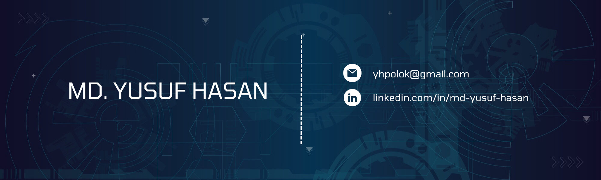

    

        
    

    

        
        
    

    

        <h1>Hi there 👋</h1>
        
I am Md. Yusuf Hasan. A passionate developer. My main areas of interest are web. A Front-end enthusiast on a journey to become a Full-stack developer. Passionate about crafting seamless web experiences.

        <ul align="left">
            <li>Currently I'm learning Redux.</li>
            <li>Working with MERN stack.</li>
        </ul>
    

    

        <h1>Tech Stack</h1>
        

            
        

    

